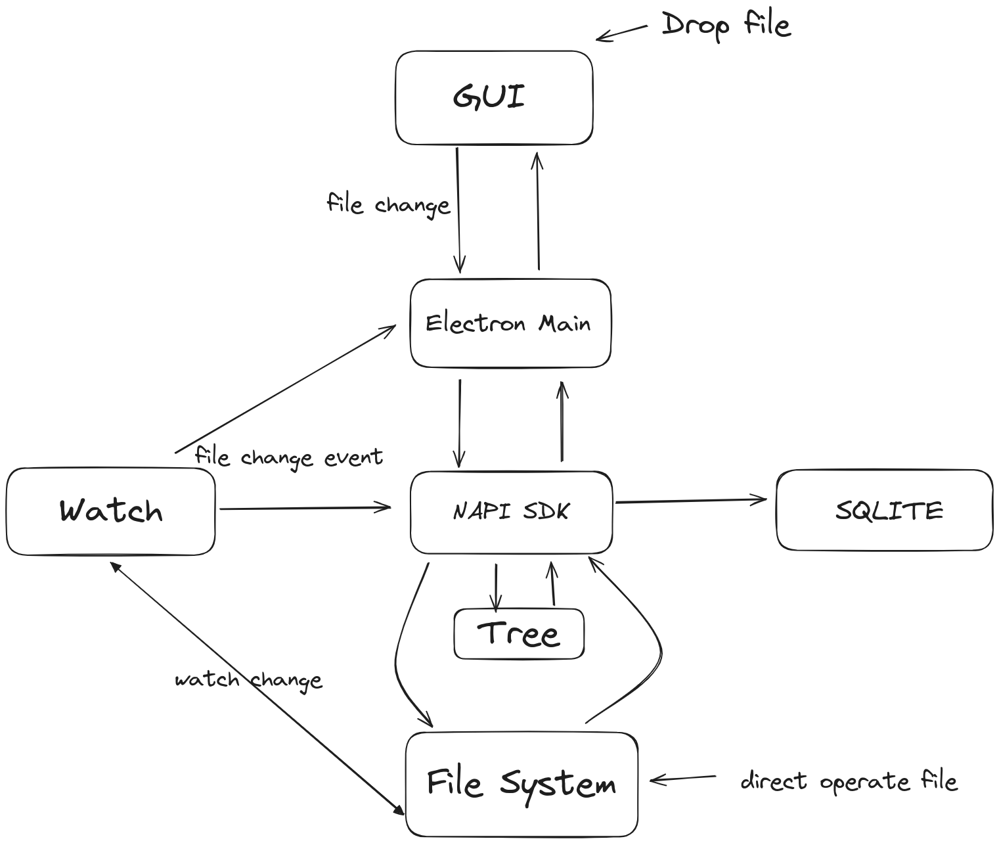

# Roadmap

Front call NAPI
NAPI watch file or dir change

- [file move]: front call napi file or directory move/add/delete, retun change directory struct
- [watch]: watch file or directory change
- [SQL]: file change update sql data
- [sync]: change lib or operate by user will triggle sync. Rebuild n-arry tree for lib file struct.

- [ ] NApi SDK
  - [ ] New/Select Asset Lib
    - [ ] check lib path access and exist
    - [ ] check lib path .ouroboros dir exist
    - [ ] init sqlite database
    - [ ] init file system watch
    - [ ] init file system tree data struct
- [ ] Watch Lib Path Files
  - [ ] Drop files from GUI
    - [ ] Watch know fs change
    - [ ] Update Sqlite3 data
  - [ ] Direct copy/move/delete file system
    - [ ] Watch know fs change
  - [ ] FS change
    - [ ] rebuild tree struct
    - [ ] notify to GUI

## Operate

- Operate From GUI
- Operate From File System

### File event

